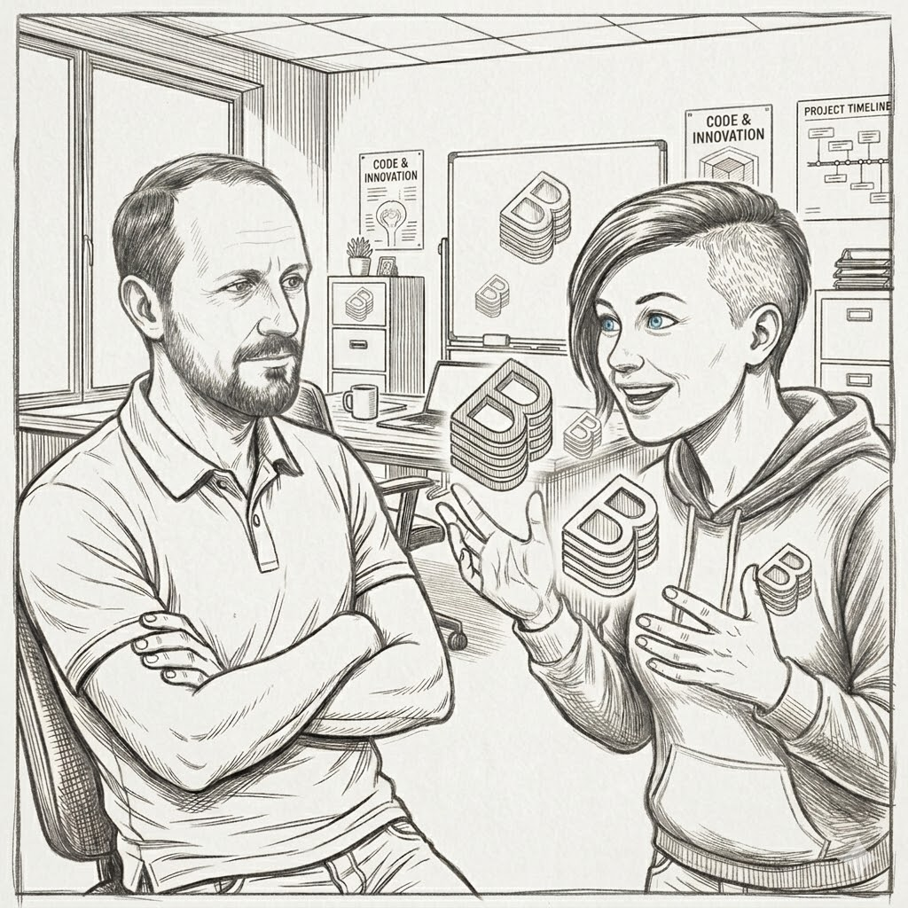

# Your Backstage, Your Problems, Your Metrics

Thomas Schuetz, TSC Labs Katharina Sick, Dynatrace

---

# Intro

  

<!--
Conversation between us:

K: Hey, I just discovered Backstage. It's so cool! It can do this, this and this and will solve all our problems! I think I'll deploy it :D

T: pushes back, does this even make sense for us? 

K: But we need better developer experience. Everyon talks about taht right now

T: Ok, but how do you know that our developer experience is actually bad at the moment? And how can you be sure, that Backstage will improve it and is not just another tool causing toil and cogntivie load?

K: Fair point. Let's fidn out. But before that: who are you actually to push me back all the time? 
-->

---

# Who are we?

  <SpeakerCard name="Katharina Sick" company="Dynatrace" role="Observability Lead" accent="#7D1CFE" image="/me.jpeg"></SpeakerCard>
  <SpeakerCard name="Thomas Schuetz" company="TSC Labs" role="Cloud Native Trainer & Architect" accent="#2b6b78" image="/tscweb.jpeg"></SpeakerCard>

<!--
Before begin with our Backstage Journey, let's introduce ourselves ...

Quick intros about us & what we're passionate about...

T: Kathi, You caught me off guard with that topic and I always hear about Backstage somewhere, so what is it about and where can it help us?

-->

---

# What is Backstage?

<!--
- K: Describes Backstage
- K: Describes Where it can improve DevEx

- K: Thomas, what do you think about it?
-->

---
layout: two-cols
---

# Overkill?

<Box accent="#01D393">Backstage is a Framework to create IDPs</Box>

<Box accent="#7D1CFE">It introduces a new component to maintain</Box>

<Box accent="#176AFA">The IDP also changes the way things work</Box>

<!--
T: Sees the problems and overhead coming with Backstage

K: Talks about the documentation, ecosystem and wide adoption

T: Asks himself how the outcome of the implementation could be measured 
-->

---
# A few days later ...

---

# SPACE and DX Core 4 Frameworks

  <BulletBox accent="#01D393" title="SPACE" :bullets="['Satisfaction', 'Performance', 'Activity', 'Communication', 'Efficiency']"></BulletBox>

  <BulletBox accent="#176AFA" title="DX Core 4" :bullets="['Flow State', 'Feedback Loops', 'Cognitive Load', 'Developer Value']"></BulletBox>

<!--
T: Did some research on Frameworks on how to measure Developer Experience and Productivity and fell across SPACE and DX Core

K: Very hyped around the DX things

T: Wants to get features and products shipped faster. So what do we need to measure to know if we are actually faster?
-->

---

# Asking the right questions

<Cloud top="5rem" right="2rem" width="320px" height="150px">
  How often is a template used?
</Cloud>

<Cloud top="20rem" right="4rem" width="320px" height="150px">
  How satisfied are developers with the IDP?
</Cloud>

<Cloud top="12rem" right="17rem" width="320px" height="150px">
  What features are missing?
</Cloud>

<Cloud top="8rem" right="35rem" width="350px" height="180px">
  How convenient is the bootstrapping process?
</Cloud>

<Cloud top="20rem" right="40rem" width="320px" height="150px">
  How often do developers switch between tools?
</Cloud>

<!--
What do we want to achieve with our IDP and which problems do we want to solve?

--> 

---

# Find the right metrics and create a baseline

<!--
- We can't search for a solution without knowing what's currently going on
- We need to create a baseline so that we have something to compare against later. Otherwise, it will be hard to know if we succeeded
- baseline metrics show we have a problem in alfi corp

This could be a big statement slide like "if you deploy with nothing to compare against, you never know if you succeeded"

Note: we should add a note that if you have backstage already running, you can also create this baseline including backstage.
-->

---

# Measurement is (not) hard

<!--
Describe how observability can be implemented in Backstage
-->

---

# Showcase

<!--
K: See! We need Backstage
T: Wait, slow down. Backstage is huge. We should also consider ....

Conclusion: for alfi corp, Backstage makes sense
-->

---

# What you saw here

<!--
Day 1:
- K: Yeees, let's finally deploy Backstage! 🥳 See, it's running. I told you it's easy to deploy and it looks so cool! Let's start using it right away!
- T: ok it's running, but now what? How do we know if it helps?
- K: Trust me, it's awesome!

Week 2:
- K: Wait.. People actually aren't using Backstage. Why? I thought everyone would love it.
- T: Well, you just deployed it without even asking what people in our company need. We already identified problems but didn't tailor Backstage to solve them. Maybe we should have started with that?
- K: True.. So what can we do about that?
- T: It's not too late. we already did the hard part. We have our baseline, we know our problems. Let's actually use that.
-->

---

# How to approach an IDP project

---

# Wrap Up
